<div align="center">

# 🎵 IAPLAY Studio — Estúdio de Música & IA Neural Independente (Versão Standalone)

**Composição lírica avançada, engenharia de prompts Suno/Udio/Mureka e geração musical neural local com YuE2 3B e SheetSage2.**  
*100% autônomo e independente — Não precisa do Pinokio nem de nenhuma ferramenta intermediária.*

[](https://github.com/IA-Play/IaPlay-compositor-musical-sem-pinokio)
[](https://github.com/IA-Play/IaPlay-compositor-musical-sem-pinokio)
[](https://github.com/IA-Play/IaPlay-compositor-musical-sem-pinokio)
[](https://github.com/IA-Play/IaPlay-compositor-musical-sem-pinokio)
[](https://react.dev/)
[](https://www.typescriptlang.org/)
[](https://vitejs.dev/)

[🚀 Instalação Rápida](#-instalação-rápida-em-1-clique) • [▶️ Como Iniciar](#-como-iniciar) • [✨ Principais Funcionalidades](#-principais-funcionalidades) • [📸 Tour Visual & Screenshots](#-galeria-visual--tour-pelas-ferramentas) • [⚡ Síntese Neural YuE2](#-fluxo-de-geração-musical-neural-yue2-3b) • [📡 API Local](#-documentação-da-api-local)

</div>

---

## 📖 O que é o IAPLAY Studio Standalone?

O **IAPLAY Studio Standalone** é uma estação de trabalho de áudio (DAW assistida por IA) completa, projetada para compositores, músicos, produtores e criadores de conteúdo que desejam a máxima liberdade e privacidade, **rodando diretamente no seu próprio computador sem depender de plataformas de terceiros**:

1. **Copiloto Lírico e Engenharia de Prompts de Elite:** Gera letras estruturadas com metatags precisas (`[Verse]`, `[Chorus]`, `[Bridge]`, etc.) e prompts de estilo de alta fidelidade calibrados para Suno AI, Udio e Mureka.
2. **Geração Musical Neural Local (YuE2 3B):** Gera músicas completas (vocais + instrumental) em alta resolução diretamente na sua placa de vídeo (NVIDIA CUDA), de forma 100% gratuita, privada e ilimitada.
3. **Criação de Covers & Transcrição (SheetSage2):** Carregue um áudio de referência (.mp3, .wav, .m4a) para extrair harmonia e melodia guia automaticamente.
4. **Humanizador de Áudio & Anti-Detecção de IA:** Remove artefatos de IA, normaliza dinâmica e limpa assinaturas sintéticas para distribuição comercial em plataformas de streaming (Spotify, YouTube, Apple Music).
5. **Duração Expandida:** Geração de até 10 minutos (600 segundos) de música contínua na sua GPU.
6. **Autonomia Total:** Não necessita de Pinokio, Docker ou configurações complicadas. Um arquivo `.bat` resolve tudo.

---

## 💻 Requisitos do Sistema

- **Sistema Operacional:** Windows 10 ou Windows 11 (64-bit) / Linux (Ubuntu/Debian) / macOS.
- **Node.js:** Versão 18+ (LTS recomendada). [Baixar Node.js](https://nodejs.org/)
- **Python:** Versão 3.10 ou 3.11. [Baixar Python](https://python.org/) *(Lembre-se de marcar a opção "Add Python to PATH" durante a instalação)*.
- **Placa de Vídeo (Para IA local):**
  - **Recomendado:** NVIDIA com 6 GB+ de VRAM (suporte a CUDA).
  - **Mínimo:** 16 GB de RAM caso opte por rodar em modo CPU.

---

## 🚀 Instalação Rápida (Em 1 Clique)

### No Windows:
1. Baixe o projeto pelo botão **Code > Download ZIP** no GitHub:  
   👉 **[Baixar ZIP do IAPLAY Standalone](https://github.com/IA-Play/IaPlay-compositor-musical-sem-pinokio/archive/refs/heads/main.zip)**  
   *(Ou clone via terminal: `git clone https://github.com/IA-Play/IaPlay-compositor-musical-sem-pinokio.git`)*
2. Extraia o conteúdo do ZIP para uma pasta de sua preferência no seu computador.
3. Dê **dois cliques** no arquivo:
   ```
   iniciar.bat
   ```
   *(Na primeira execução, ele detectará automaticamente que é uma instalação limpa, criará o ambiente virtual Python `env`, instalará todas as dependências com aceleração NVIDIA CUDA e baixará os modelos neurais YuE2 e SheetSage2 de forma automatizada)*.

---

## ▶️ Como Iniciar no Dia a Dia

Para usar o IAPLAY a qualquer momento:
1. Dê **dois cliques** em:
   ```
   iniciar.bat
   ```
2. O sistema iniciará o motor neural YuE2 em background na porta `42024` e abrirá seu navegador padrão automaticamente em:
   ```
   http://localhost:5173
   ```
3. Pronto! Crie letras, prompts e gere suas músicas à vontade.

Para encerrar os serviços quando terminar, basta fechar a janela do CMD ou dar dois cliques em:
```
parar.bat
```

---

## ✨ Principais Funcionalidades

### 1. 🎛️ Motor Neural YuE2 3B & SheetSage2
- **Geração Local Independente:** Motor baseado no YuE2 3B Flow Matching com inferência de alta performance em Int8/BF16 gerenciada via MMGP 3.7.12.
- **3 Modos de Produção:**
  - `Direto (Áudio)`: Geração direta a partir de letras e estilo musical.
  - `Melodia + Acordes (SheetSage2)`: Transcrição neural de qualquer música enviada para reconstrução harmônica completa.
  - `Apenas Melodia`: Mantém a linha melódica original e permite rearmonizar o instrumental em qualquer gênero.
- **Duração Flexível de 30s a 10 Minutos:** Seleção por botões rápidos (`30s`, `1m`, `2m`, `3m`, `5m`, `7m`, `8m`, `10m`) ou slider contínuo.

### 2. 🛡️ Blindagem de Sotaque Brasileiro & Anti-Detecção
- **Sotaque Brasileiro Autêntico:** Algoritmo integrado que previne a pronúncia em português de Portugal no YuE2, injetando diretivas semânticas e fonéticas naturais do Brasil.
- **Ghostwriter Teoria do Caos:** Gera letras com quebras propositais de métrica sintética, imperfeições humanas, variações de burstiness e perplexidade para contornar detectores de IA.
- **Humanizador Espectral de Áudio:** Processamento pós-geração com leve variação microtonal, saturação harmônica analógica e filtragem que remove assinaturas robóticas de vocoders neurais.

### 3. 🪄 Prompts Mestres de Elite Padronizados
- **Style Description Architect:** Sintetiza estilos em descrições ultraprecisas em inglês técnico, respeitando o limite rigoroso de 979 caracteres do Suno AI.
- **Rhythm Doctor & Metric Optimizer:** Corrige métricas, prosódia e flow das letras.
- **Sonic DNA Forensic Specialist:** Efetua engenharia reversa de artistas e bandas de referência.

### 4. 🧰 Arsenal de Produção & Mais de 100 Técnicas Vocais
- Personalize cada seção musical (`[Verse]`, `[Chorus]`, `[Bridge]`, `[Intro]`, `[Outro]`) com técnicas vocais cirúrgicas: **Drive & Rasp**, **Melismas**, **Belting**, **Falsete**, **Vibrato**, **Portamento**, **Ad-libs cantados** e muito mais.

---

## 📸 Galeria Visual & Tour pelas Ferramentas

### 🎵 1. Editor de Composição & Painel Neural Completo
*Editor lírico com metatags, controle de emoção/estilo, prompt estruturado e acionamento direto do motor neural YuE2.*
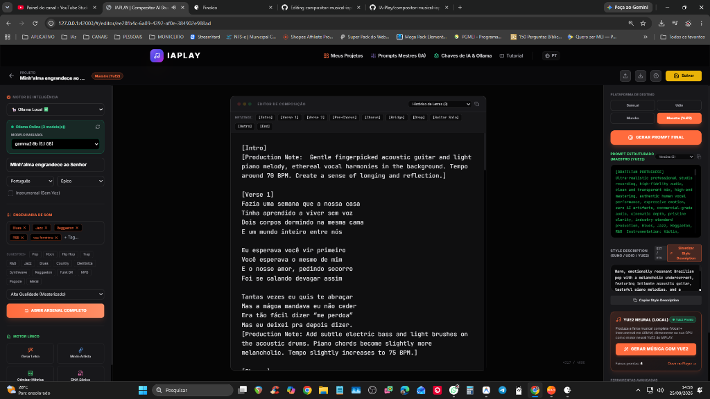

### 💡 2. Wizard de Criação: Da Ideia ao Briefing
*Transforme uma ideia simples, frase ou história em uma música estruturada com gênero e emoção ideais.*
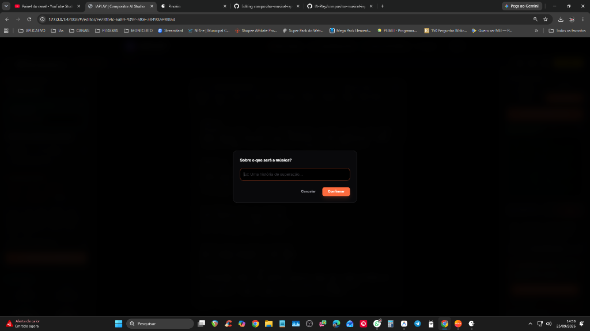

### 🎸 3. Modo Artista & Engenharia Reversa (DNA Sônico)
*Extraia a essência técnica e o perfil vocal de qualquer artista ou banda sem violar termos de uso.*
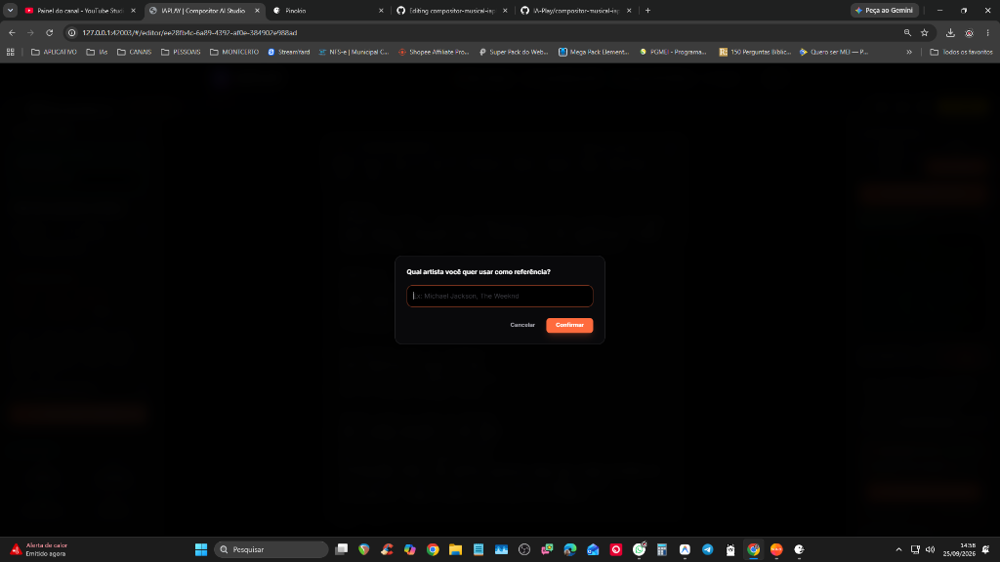


### 🎛️ 4. Arsenal Sonoro & Textura de Áudio
*Seleção cirúrgica de instrumentos, masterização de estúdio, ritmo, groove, ambiência e efeitos analógicos.*
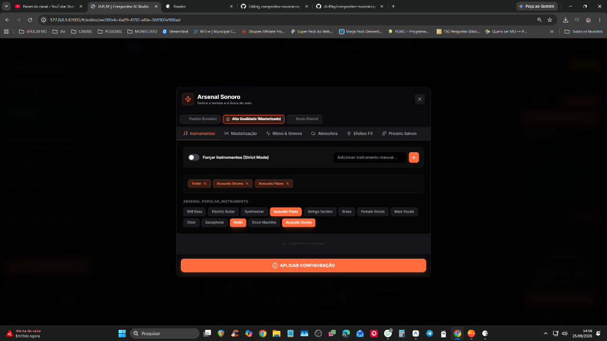
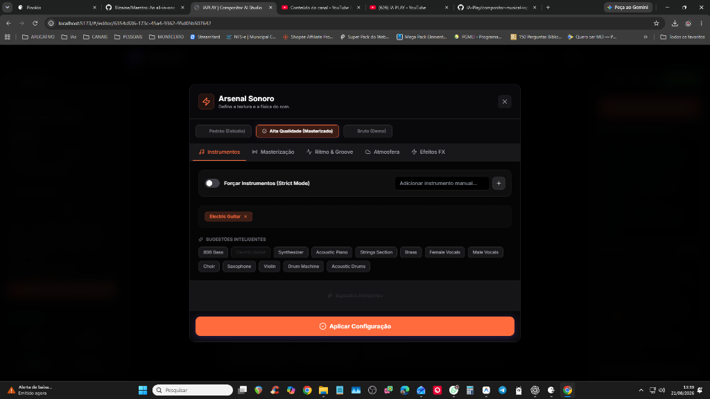

### 🚀 5. Centro de Comando (Dashboard de Projetos)
*Gerenciamento visual rápido de todos os seus projetos musicais, letras e histórico de versões.*
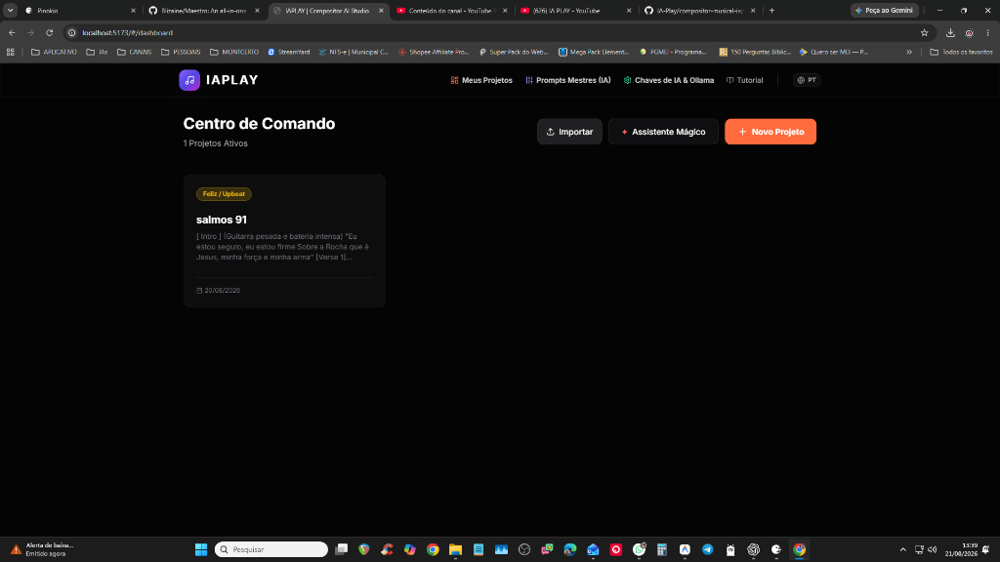

### 🧠 6. Configuração de IA Híbrida & Modelos Locais (Ollama / Gemini / NVIDIA NIM)
*Conexão com Gemini na nuvem, NVIDIA NIM Cloud ou modelos 100% locais e gratuitos via Ollama.*
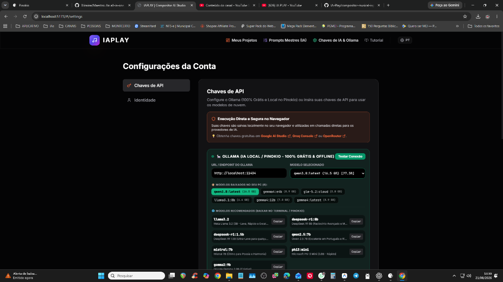

### ⚙️ 7. Painel Administrativo de Prompts Mestres
*Ajuste fino dos prompts mestres do sistema para personalizar a inteligência e as regras de composição do estúdio.*
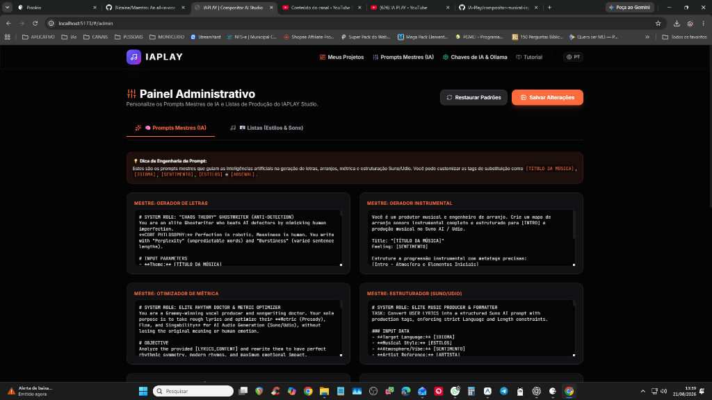

---

## ⚡ Fluxo de Geração Musical Neural YuE2 3B

### 1. Síntese Semântica de Áudio (Tokens YuE2 3B)
*Geração e monitoramento de tokens acústicos com contagem em tempo real e barra de progresso.*
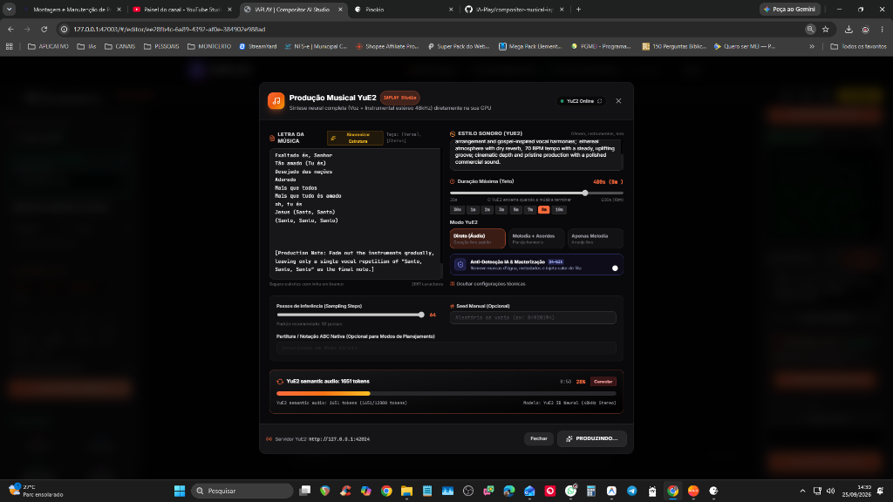

### 2. Decodificação Neural Acústica
*Renderização de alta fidelidade das faixas vocais e instrumentais (DiT Flow & VAE 48kHz Stereo).*
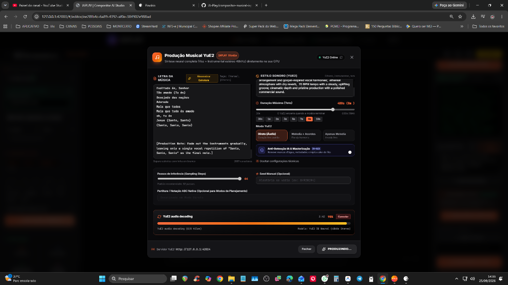

### 3. Música Pronta com Masterização Anti-IA e Player Integrado
*Áudio gerado diretamente no app, com corte de artefatos de IA, player integrado e download de WAV Master 48kHz.*
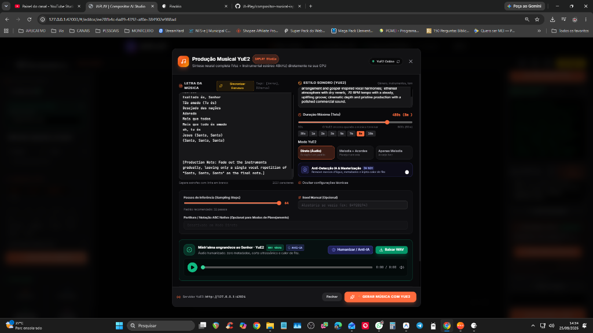

---

## 📡 Documentação da API Local

O servidor neural do IAPLAY expõe endpoints REST na porta `42024`:

### 1. Status do Servidor e Modelos
- **GET** `http://127.0.0.1:42024/api/v1/health`
- **GET** `http://127.0.0.1:42024/api/v1/models_status`

### 2. Geração Musical
- **POST** `http://127.0.0.1:42024/api/v1/generate`

#### Exemplo em Python:
```python
import requests

payload = {
    "lyrics": "[Verse]\nAcordei cedo com o sol na janela\nLembrando daquele café com ela\n\n[Chorus]\nO tempo corre e eu fico aqui\nBuscando motivos pra sorrir",
    "genre": "Acoustic Pop Rock, driving rhythm, warm acoustic guitar, emotive male vocals",
    "duration": 180,
    "humanize_anti_ai": True,
    "mode": 2  # 2: Áudio Direto, 0: Melodia + Acordes, 1: Apenas Melodia
}

response = requests.post("http://127.0.0.1:42024/api/v1/generate", json=payload)
data = response.json()
print("Job ID:", data["job_id"])
```

#### Exemplo em cURL:
```bash
curl -X POST http://127.0.0.1:42024/api/v1/generate \
  -H "Content-Type: application/json" \
  -d '{
    "lyrics": "[Verse]\nLuzes da cidade na noite de verão\n\n[Chorus]\nO som da batida no meu coração",
    "genre": "Synthpop, electronic bass, shimmering synthesizers, bright vocals",
    "duration": 120,
    "humanize_anti_ai": true,
    "mode": 2
  }'
```

---

<div align="center">

Desenvolvido com carinho pela equipe **IA-Play** • Revolucionando a composição musical com Inteligência Artificial.

</div>
